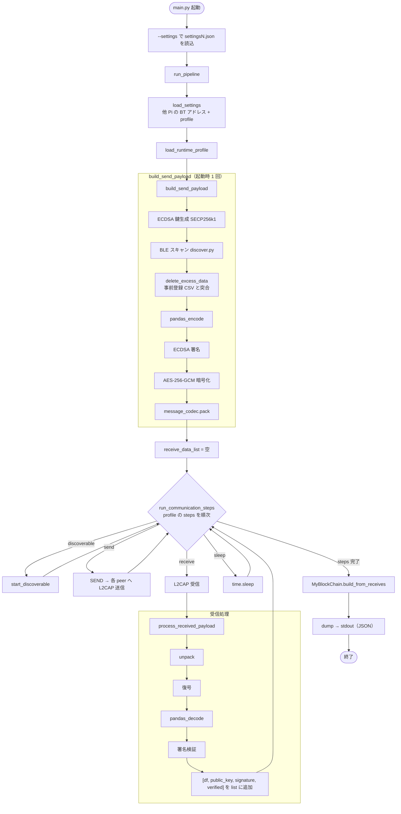
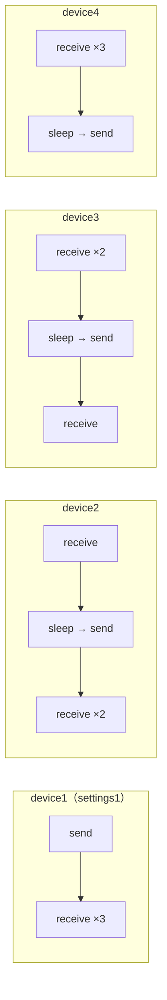

# BLE_Blockchain

卒論向けに、Raspberry Pi 複数台で BLE スキャン結果を暗号化・署名して L2CAP で交換し、過半数合意でブロックチェーンを構築するシステムです。

## システムの概要

- Raspberry Pi（4 台想定）が BLE ビーコン周辺をスキャンし、事前登録 CSV と突合したデータを扱う
- ペイロードは **ECDSA 署名** と **AES-256-GCM 暗号化** のあと JSON でシリアライズする
- Pi 間は **Bluetooth L2CAP**（`l2cap_client` / `l2cap_server`）で通信する
- 同時送受信を避けるため、`config/runtime_profiles.json` で端末ごとに **ラウンドロビン**（send / receive / sleep）を定義する
- 検証済みの受信データから **過半数** の報告が揃った `bt_addrs` をブロックに載せ、チェーンを標準出力する

本番のエントリポイントは **`main.py` のみ**です（旧 `main1.py`〜`main4.py` は統合済み）。

## リポジトリ構成（主要）

| パス | 役割 |
|------|------|
| `main.py` | パイプライン全体（設定読込 → ペイロード生成 → 送受信 → チェーン出力） |
| `send_and_receive.py` | 他 Pi への L2CAP 送信（`SEND`） |
| `ble/discover.py` | BLE スキャン（Bleak） |
| `ble/l2cap_client.py` / `ble/l2cap_server.py` | L2CAP 送受信（PyBlueZ・Linux / Pi） |
| `ble/start_discoverable.py` | `bluetoothctl discoverable on` |
| `ble/message_codec.py` | JSON ペイロードの `pack` / `unpack` |
| `delete_excess_data.py` | 事前登録 CSV との突合・フィルタ |
| `pandas_d_encode.py` | DataFrame ↔ CSV bytes |
| `cipher/cipher.py` / `cipher/aes_cipher.py` | ECDSA・AES-256-GCM |
| `blockchain/myblock.py` | ブロック生成・チェーン構築 |
| `config/runtime_profiles.json` | 端末別 `steps`（discoverable / send / receive / sleep） |
| `settings1.json`〜`settings4.json` | 他 Pi の BT アドレス + `profile` |
| `config/*.json` | L2CAP・暗号・パス・ブロックチェーン設定 |
| `tests/` | pytest ユニットテスト |

## セットアップ

### Python 依存関係（uv 推奨）

[uv](https://docs.astral.sh/uv/) を使って仮想環境とパッケージを管理します。

```bash
# uv 未導入の場合（例）
curl -LsSf https://astral.sh/uv/install.sh | sh

cd BLE_Blockchain
uv sync
```

開発用ツール（pylint / pytest）も入れる場合:

```bash
uv sync --group dev
```

### Raspberry Pi 上のシステム依存

BLE（PyBlueZ 等）用の apt パッケージは従来どおり必要です。

```bash
sudo apt-get install git
git clone https://github.com/Fu-Te/BLE_Blockchain
cd BLE_Blockchain
python3 install_package.py   # apt + pip（Pi 向け）
uv sync                      # 上記のあと uv で Python 依存を揃える場合
```

Raspberry Pi の BLE では検索に時間がかかることがあるため、受信側は **discoverable** にする必要があります。本リポジトリでは `runtime_profiles.json` の `discoverable` ステップ実行時に `start_discoverable()` が `bluetoothctl discoverable on` を呼び出します。

### AES 共有鍵（全 Pi で同一）

`.env.example` をコピーして `.env` を作成し、64 文字の hex（32 バイト）の AES-256 鍵を設定してください。

```bash
cp .env.example .env
# .env の BLE_AES_KEY を編集（全 Raspberry Pi で同じ値を使う）
export BLE_AES_KEY=$(grep BLE_AES_KEY .env | cut -d= -f2)
```

本番環境では鍵配布を別途設計してください（卒論実験用の共有鍵想定）。

### 設定ファイル

| ファイル | 内容 |
|---------|------|
| `config/l2cap.json` | L2CAP PSM、受信バッファ、接続タイムアウト |
| `config/crypto.json` | AES 鍵の環境変数名（`BLE_AES_KEY`） |
| `config/paths.json` | 事前登録 CSV パス |
| `config/blockchain.json` | ブロックチェーン関連設定（`majority_ratio` は将来用・現状未使用） |
| `config/runtime_profiles.json` | 端末別送受信ステップ |

各 Raspberry Pi には端末専用の設定ファイル（`settings1.json`〜`settings4.json`）を用意しています。
設定ファイルには、**自端末以外**の Bluetooth アドレス（3 台分）と、送受信フローを表す `profile` キーを記載してください。

| 端末 | 設定ファイル | profile（例） |
|------|-------------|----------------|
| Pi 1 | `settings1.json` | `device1` |
| Pi 2 | `settings2.json` | `device2` |
| Pi 3 | `settings3.json` | `device3` |
| Pi 4 | `settings4.json` | `device4` |

実行例:

```bash
uv run python main.py --settings settings1.json
```

`uv` を使わない場合は `python3 main.py --settings settings1.json` でも同様です。

`profile` キーは `config/runtime_profiles.json` の端末別フロー（送受信順序）と対応しています。
送受信のタイミングや sleep 秒数を変更する場合は `config/runtime_profiles.json` を編集してください。

CLI オプションは **`--settings` のみ**です（サブコマンドなし）。

## 処理の流れ

実装（`main.py`）に基づく全体フローです。**BLE スキャンとペイロード生成は起動時に 1 回**行い、その後 `runtime_profiles` の `steps` を順に実行します。`discoverable` は各ステップ内で呼ばれ、スキャンより**後**に実行されます。

### 全体フローチャート



### テキスト要約

1. `settingsN.json` から他 Pi の BT アドレスと `profile` を読み込む
2. ECDSA 秘密鍵・公開鍵を生成する
3. BLE 端末をスキャンする（`ble/discover.py`）
4. 事前登録 CSV と照合し不要データを除去する（`delete_excess_data.py`）
5. CSV bytes に ECDSA 署名する
6. 同一 CSV bytes を AES-256-GCM で暗号化する
7. JSON ペイロードにシリアライズする（`ble/message_codec.py`）
8. `runtime_profiles` の `steps` に従い、discoverable / send / receive / sleep を実行する
9. 受信ごとに復号・署名検証する（検証失敗はチェーン追加対象外）
10. 検証済み受信の過半数以上で同じ `bt_addrs` が報告された行をブロックに追加し、チェーンを出力する

### 4 台 Pi の送受信タイミング

`config/runtime_profiles.json` により、同時に send しないよう時間分割しています（デフォルト sleep は 30 秒）。



各 profile の先頭には `discoverable` ステップが含まれます（図では省略）。

### ブロックチェーンへの反映

- ブロックは **他 Pi から受信したペイロード**（`receive_data_list`）のみから構築します。自端末がスキャンした内容は、送信先 Pi の受信データとして間接的に載る想定です。
- 過半数の閾値は **検証済み受信件数** に対する `len(verified_dfs) // 2 + 1` です（4 台中 3 台固定ではありません）。
- `dump()` は標準出力のみで、ファイル永続化や Pi 間のチェーン同期は実装していません。

### 実行環境の注意

- L2CAP（PyBlueZ）は **Linux（Raspberry Pi）** 向けです。macOS では送受信部分は動作しません。
- 全 Pi で `main.py` を起動するタイミングの同期は、主に `sleep` 秒数に依存します。

## セキュリティ

- **AES-256-GCM**: ペイロード暗号化（共有鍵 `BLE_AES_KEY`）
- **ECDSA (SECP256k1)**: CSV 平文 bytes への署名・検証
- L2CAP メッセージ形式: `version`, `ciphertext_b64`, `nonce_b64`, `public_key_pem`, `signature_b64`

## テスト

```bash
uv sync --group dev
uv run pytest tests/
```

## 未実装（将来）

- データを Web 上で確認
- CSV データを LAN 内から取得
- ブロックチェーン検証用 Docker（検討中）

## 参考

受信後の各要素: `[df, public_key, signature, verified]`
