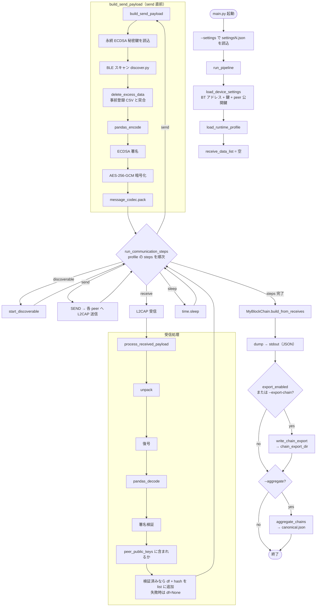
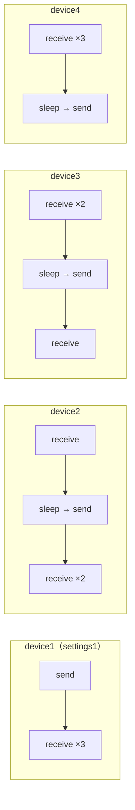

# BLE_Blockchain

卒論向けに、Raspberry Pi 複数台で BLE スキャン結果を暗号化・署名して L2CAP で交換し、過半数合意でブロックチェーンを構築するシステムです。

## システムの概要

- Raspberry Pi（4 台想定）が BLE ビーコン周辺をスキャンし、事前登録 CSV と突合したデータを扱う
- ペイロードは **ECDSA 署名** と **AES-256-GCM 暗号化** のあと JSON でシリアライズする
- Pi 間は **Bluetooth L2CAP**（`l2cap_client` / `l2cap_server`）で通信する
- 同時送受信を避けるため、`config/runtime_profiles.json` で端末ごとに **ラウンドロビン**（send / receive / sleep）を定義する
- 検証済みの受信データから **過半数** の報告が揃った `bt_addrs` をブロックに載せ、チェーンを標準出力する

本番のエントリポイントは **`main.py` のみ**です（旧 `main1.py`〜`main4.py` は統合済み）。

## リポジトリ構成（主要）

| パス | 役割 |
|------|------|
| `main.py` | パイプライン全体（設定読込 → ペイロード生成 → 送受信 → チェーン出力） |
| `send_and_receive.py` | 他 Pi への L2CAP 送信（`SEND`） |
| `ble/discover.py` | BLE スキャン（Bleak） |
| `ble/l2cap_client.py` / `ble/l2cap_server.py` | L2CAP 送受信（PyBlueZ・Linux / Pi） |
| `ble/start_discoverable.py` | `bluetoothctl discoverable on` |
| `ble/message_codec.py` | JSON ペイロードの `pack` / `unpack` |
| `delete_excess_data.py` | 事前登録 CSV との突合・フィルタ |
| `pandas_d_encode.py` | DataFrame ↔ CSV bytes |
| `cipher/cipher.py` / `cipher/aes_cipher.py` | ECDSA・AES-256-GCM |
| `blockchain/myblock.py` | ブロック生成・チェーン構築 |
| `blockchain/export.py` | チェーン JSON のエクスポート（`config/paths.json` の出力先） |
| `blockchain/persistence.py` | チェーン JSON の読み書き |
| `blockchain/validator.py` | エクスポートファイルの検証 |
| `blockchain/sync.py` | 複数エクスポートのマージ・最長チェーン選択 |
| `blockchain/aggregator.py` | canonical チェーンの集約 CLI |
| `config/runtime_profiles.json` | 端末別 `steps`（discoverable / send / receive / sleep） |
| `settings1.json`〜`settings4.json` | 他 Pi の BT アドレス + `profile` |
| `config/*.json` | L2CAP・暗号・パス・ブロックチェーン設定 |
| `tests/` | pytest ユニットテスト |
| `docs/` | Sphinx API リファレンス（[docs/README.md](docs/README.md)）、構成図 |
| `docs/diagrams/ble-blockchain-architecture.drawio` | システム構成・処理フロー・送受信タイミング（draw.io） |

### 構成図（draw.io）

[docs/diagrams/ble-blockchain-architecture.drawio](docs/diagrams/ble-blockchain-architecture.drawio) を [draw.io](https://app.diagrams.net/) または VS Code の **Draw.io Integration** 拡張で開いてください。

| シート | 内容 |
|--------|------|
| 1-システム構成 | Pi 4 台、設定、L2CAP、ブロックチェーン集約・Docker 検証 |
| 2-処理フロー | `main.py` のパイプライン（send 直前スキャン、受信検証、チェーン構築） |
| 3-送受信タイミング | `runtime_profiles.json` によるラウンドロビン |

## セットアップ

### Python 依存関係（uv 推奨）

[uv](https://docs.astral.sh/uv/) を使って仮想環境とパッケージを管理します。

```bash
# uv 未導入の場合（例）
curl -LsSf https://astral.sh/uv/install.sh | sh

cd BLE_Blockchain
uv sync
```

開発用ツール（pylint / pytest）も入れる場合:

```bash
uv sync --group dev
```

### Raspberry Pi 上のシステム依存

BLE（PyBlueZ 等）用の apt パッケージは従来どおり必要です。

```bash
sudo apt-get install git
git clone https://github.com/Fu-Te/BLE_Blockchain
cd BLE_Blockchain
python3 install_package.py   # apt + pip（Pi 向け）
uv sync                      # 上記のあと uv で Python 依存を揃える場合
```

Raspberry Pi の BLE では検索に時間がかかることがあるため、受信側は **discoverable** にする必要があります。本リポジトリでは `runtime_profiles.json` の `discoverable` ステップ実行時に `start_discoverable()` が `bluetoothctl discoverable on` を呼び出します。

### AES 共有鍵（全 Pi で同一）

`.env.example` をコピーして `.env` を作成し、64 文字の hex（32 バイト）の AES-256 鍵を設定してください。

```bash
cp .env.example .env
# .env の BLE_AES_KEY を編集（全 Raspberry Pi で同じ値を使う）
export BLE_AES_KEY=$(grep BLE_AES_KEY .env | cut -d= -f2)
```

本番環境では鍵配布を別途設計してください（卒論実験用の共有鍵想定）。

### 設定ファイル

| ファイル | 内容 |
|---------|------|
| `config/l2cap.json` | L2CAP PSM、受信バッファ、接続タイムアウト |
| `config/crypto.json` | AES 鍵の環境変数名（`BLE_AES_KEY`） |
| `config/paths.json` | 事前登録 CSV パス・チェーンエクスポート／集約ディレクトリ（`chain_export_dir`） |
| `config/blockchain.json` | 過半数比率・最小検証済み受信数・content_hash 一致・集約時の最小 Pi 数など |
| `config/runtime_profiles.json` | 端末別送受信ステップ |

各 Raspberry Pi には端末専用の設定ファイル（`settings1.json`〜`settings4.json`）を用意しています。
設定ファイルには、**自端末以外**の Bluetooth アドレス（3 台分）、送受信フローを表す `profile`、`signing_key_path`（端末ごとの永続 ECDSA 秘密鍵）、`public_key_pem`、他 Pi の `peer_public_keys` を記載してください。

鍵の初回生成:

```bash
uv run python scripts/generate_device_keys.py
```

詳細は [keys/README.md](keys/README.md) を参照してください。`keys/*_private.pem` は Git に含めません。

| 端末 | 設定ファイル | profile（例） |
|------|-------------|----------------|
| Pi 1 | `settings1.json` | `device1` |
| Pi 2 | `settings2.json` | `device2` |
| Pi 3 | `settings3.json` | `device3` |
| Pi 4 | `settings4.json` | `device4` |

実行例:

```bash
uv run python main.py --settings settings1.json
```

`uv` を使わない場合は `python3 main.py --settings settings1.json` でも同様です。

`profile` キーは `config/runtime_profiles.json` の端末別フロー（送受信順序）と対応しています。
送受信のタイミングや sleep 秒数を変更する場合は `config/runtime_profiles.json` を編集してください。

CLI オプション:

| オプション | 説明 |
|-----------|------|
| `--settings` | 端末設定 JSON（既定: `settings1.json`） |
| `--export-chain` | チェーンを `config/paths.json` の `chain_export_dir` に JSON 出力 |
| `--no-export-chain` | 設定で有効でもエクスポートをスキップ |
| `--aggregate` | `chain_export_dir` 内のエクスポートから canonical チェーンを生成 |
| `--aggregate-output` | 集約出力パス（既定: `{chain_export_dir}/canonical.json`） |
| `--aggregate-strict` | 集約時に `min_distinct_devices_for_aggregate` 未満ならエラー終了 |

`config/blockchain.json` の `export_enabled: true` の場合、追加オプションなしでもエクスポートされます。

`config/blockchain.json` の主なキー:

| キー | 意味（既定値の例） |
|------|-------------------|
| `majority_ratio` | 検証済み**報告者（受信 Pi）数**に対する過半数比率（`0.5` → `n//2+1`） |
| `min_verified_receives` | チェーン構築に必要な最小検証済み受信数（例: `3`） |
| `require_content_hash_agreement` | 同一 `bt_addrs` 採用時に payload の content_hash 一致を要求 |
| `min_distinct_devices_for_aggregate` | canonical 集約時に推奨する異なる `device_id` の最小数 |

## 処理の流れ

実装（`main.py`）に基づく全体フローです。**BLE スキャンとペイロード生成は `send` ステップの直前**に行い、その後 `runtime_profiles` の `steps` を順に実行します。署名には `settingsN.json` の永続秘密鍵を使います。

### 全体フローチャート



### テキスト要約

1. `settingsN.json` から他 Pi の BT アドレスと `profile` を読み込む
2. ECDSA 秘密鍵・公開鍵を生成する
3. BLE 端末をスキャンする（`ble/discover.py`）
4. 事前登録 CSV と照合し不要データを除去する（`delete_excess_data.py`）
5. CSV bytes に ECDSA 署名する
6. 同一 CSV bytes を AES-256-GCM で暗号化する
7. JSON ペイロードにシリアライズする（`ble/message_codec.py`）
8. `runtime_profiles` の `steps` に従い、discoverable / send / receive / sleep を実行する
9. 受信ごとに復号・署名検証する（検証失敗はチェーン追加対象外）
10. 検証済み受信が `min_verified_receives` 以上のとき、**ユニーク報告者数**が過半数以上かつ `content_hash` が一致した `bt_addrs` を、CSV 再突合後の gakuseki 多数決でブロックに追加し、チェーンを出力する

### 4 台 Pi の送受信タイミング

`config/runtime_profiles.json` により、同時に send しないよう時間分割しています（デフォルト sleep は 30 秒）。



各 profile の先頭には `discoverable` ステップが含まれます（図では省略）。

### ブロックチェーンへの反映

本システムのチェーンは **署名付き観測レジャー + 過半数採択 + 検証可能チェーン** です（PoW は使用しません）。

- ブロックは **他 Pi から受信したペイロード**（`receive_data_list`）のみから構築します。
- 受信 DataFrame は **事前登録 CSV と `(gakuseki, bt_addrs)` で再突合** されます（`filter_registered_data`）。
- 過半数は **検証済み受信 Pi（報告者）のユニーク数** で数え、DataFrame の行数では水増しできません。
- 同一 `bt_addrs` について報告者の `payload_content_hash` が一致しない場合はブロック化しません。
- gakuseki は報告者ごとの票の最多決。同点の場合はブロック化しません。
- 受信時は `peer_public_keys` に登録された公開鍵のみ信頼します。
- 各ブロックには `tran_meta`（報告者 fingerprint・content_hash・count・gakuseki_votes）が付きます。
- `validate_chain()` でハッシュ連鎖、`load_chain` / Docker 検証で `tran_meta` の整合も確認します。
- `dump()` は標準出力、`data/chains/{device_id}_{timestamp}.json` へエクスポート可能です。

#### チェーン集約（Pi 間）

各 Pi のエクスポート JSON を 1 台に集め、最長合法チェーンを canonical として選びます（`device_id` が複数あることが推奨。`--aggregate-strict` で強制可能）。

```bash
# 各 Pi で実行（例）
uv run python main.py --settings settings1.json

# 集約（エクスポート JSON を chain_export_dir に集めたうえで。省略時は config/paths.json のパスを使用）
uv run python -m blockchain.aggregator
# または明示指定:
# uv run python -m blockchain.aggregator --input-dir data/chains --output data/chains/canonical.json

# または main.py から
uv run python main.py --settings settings1.json --aggregate
```

#### Docker によるチェーン検証

```bash
docker build -t ble-chain-validator -f docker/chain-validator/Dockerfile .
docker run --rm -v "$(pwd)/data:/data" ble-chain-validator /data/chains/canonical.json
```

終了コード `0` は `validate_chain()` 成功を意味します。詳細は [docker/chain-validator/README.md](docker/chain-validator/README.md) を参照してください。

### 実行環境の注意

- L2CAP（PyBlueZ）は **Linux（Raspberry Pi）** 向けです。macOS では送受信部分は動作しません。
- 全 Pi で `main.py` を起動するタイミングの同期は、主に `sleep` 秒数に依存します。

## セキュリティ

- **AES-256-GCM**: ペイロード暗号化（共有鍵 `BLE_AES_KEY`）
- **ECDSA (SECP256k1)**: CSV 平文 bytes への署名・検証
- L2CAP メッセージ形式: `version`, `ciphertext_b64`, `nonce_b64`, `public_key_pem`, `signature_b64`

### 限界（設計上の前提）

- 過半数は **検証済み受信 Pi（報告者）のユニーク数** に対する相対過半数であり、4 台固定の BFT ではありません。
- `min_verified_receives` 未満、または受信失敗が多いとブロックは生成されません。
- 悪意 Pi が過半数の報告者を占めると虚偽観測を載せられる可能性があります（`peer_public_keys` で身元は限定）。
- 共有 AES 鍵はペイロード機密性を守ります。チェーン整合性はハッシュ連鎖と `tran_meta` で補強します。
- 真の分散合意（PBFT 等）はスコープ外です。集約は **検証可能な最長チェーン選択** です。

**Breaking change**: 過半数の定義・`tran_meta` 構造・受信フィルタを変更しました（`chain_hash_version: 2`）。旧エクスポート JSON は再生成が必要です。鍵は `scripts/generate_device_keys.py` で再生成してください。

## テスト

```bash
uv sync --group dev
uv run pytest tests/
uv run pytest tests/integration/
```

## 未実装（将来）

- データを Web 上で確認
- CSV データを LAN 内から取得
- L2CAP 経由でのチェーン JSON 同期（現状はファイルベース集約）

## 参考

受信後の各要素: `[df, public_key, signature, verified, public_key_pem, payload_content_hash]`
